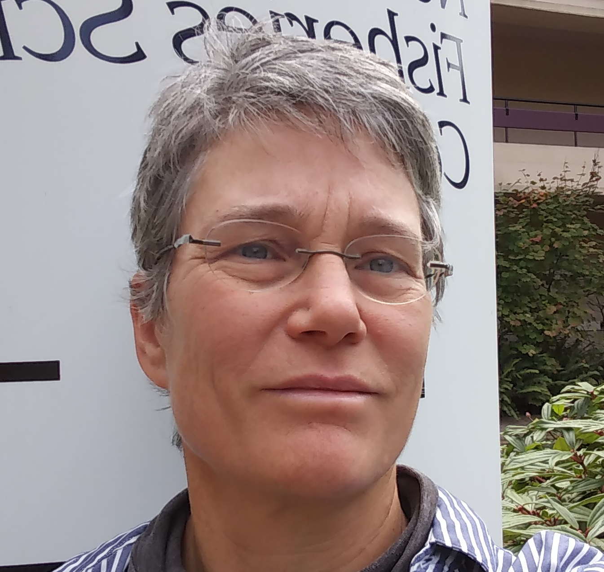

**Research Scientist** 
NOAA Fisheries 
[Northwest Fisheries Science Center](https://www.nwfsc.noaa.gov/) 
Conservation Biology Divison 

**Affiliate Faculty** 
University of Washington 
School of Aquatic and Fishery Sciences 

**Contact and Websites**
<ul class="ul-edu fa-ul">
<li>
<i class="fa fa-envelope"></i> eeholmes@uw.edu
</li>

<li>
<i class="fa fa-google"></i> [GoogleScholar](https://scholar.google.com/citations?user=HtIhixwAAAAJ)
</li>

<li>
<i class="fa fa-graduation-cap"></i> [ResearchGate](https://www.researchgate.net/profile/Elizabeth_Holmes)
</li>

<li>
<i class="fa fa-github"></i> [GitHub](https://github.com/eeholmes) </li>

<li>
NWFSC Time Series [<i class="fa fa-globe"></i>](https://nwfsc-timeseries.github.io) [<i class="fa fa-github"></i>](https://github.com/nwfsc-timeseries)
</li>

<li>
RVerse Tutorials [<i class="fa fa-globe"></i>](https://rverse-tutorials.github.io/RWorkflow-Workshop/) [<i class="fa fa-github"></i>](https://github.com/RVerse-Tutorials)
</li>

<li>
Fish Forecast [<i class="fa fa-book"></i>](https://fish-forecast.github.io/Fish-Forecast-Bookdown/) [<i class="fa fa-globe"></i>](https://fish-forecast.github.io/Fish-Forecast-Webpage/)  [<i class="fa fa-github"></i>](https://github.com/fish-forecast)
</li>

<!--
<li>
<i class="fa fa-stack-overflow"></i> [Stack Overflow](https://www.stackoverflow.com/users/2403645/eli-holmes)
</li>
-->

</ul>

<h4>New courses and tutorials</h4>
<a href="https://nwfsc-timeseries.github.io/">Applied Time-Series Analysis for Fisheries and Environmental Data</a> 
<a href="https://rverse-tutorials.github.io/Fish-Forecast-Training-Course/">Fish catch forecasting and R Workflow with RStudio</a> 
<a href="https://fish-forecast.github.io/Fish-Forecast-Bookdown/">Fish Forecast online book</a> from the material.

My research is focused on stochastic processes and statistical models for complex multivariate, interacting systems. Much of what I do involves developing algorithms for fitting multivariate autoregressive state-space (MARSS) models to time-series data, which comes up in vector autoregressive state-space modeling, dynamic linear modeling, MAR(1) modeling, and dynamic factor analysis. I developed an EM algorithm for fitting a general constrained version of these models and develped the MARSS package for fitting such models. In my spare time, I've been working on predictive models of "multi-player" systems---I've been studying this with soccer match data. This is another application of my work on developing predictive models using 'bad' data. 

I am part of a NWFSC research group working in the area of hierarchical modeling and inference. Group members include myself, [Eric Ward](https://eric-ward.github.io/), [Mark Scheuerell](http://faculty.washington.edu/scheuerl/), and [Jim Thorson](https://sites.google.com/site/thorsonresearch/), along with their post-docs and students. We develop statistical methods for ecological problems and apply these to resource and endangered species management questions. We collaborate a lot with folks at the University of Washington School for Aquatic and Fisheries Sciences (SAFS).
